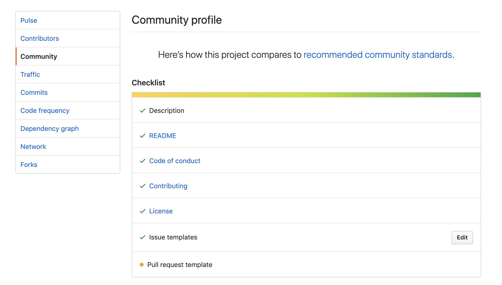

# CGX - CLI to Generate recommended documentation/files to improve contribution

[](https://github.com/jeroenouw/cgx)
[](https://github.com/jeroenouw/cgx/blob/master/LICENSE/)
[](https://github.com/jeroenouw/cgx)

Do you want people to contribute to your project? Make it easy for your contributors. Generate all the recommended documentation/files (pre-filled) for the Github, Gitlab and Bitbucket community standards. This project has 100% type coverage checked by [tscov](https://github.com/jeroenouw/liftr-tscov).

> Generate multiple files at once
<p align="center"></p>

> Generate a license
<p align="center"></p>

## Files that can be generated
More files & providers in future versions.

### Github, Gitlab and Bitbucket
* License 
  - MIT
  - ISC
  - Apache 2.0
  - BSD 2-Clause
  - GPLv3
* Changelog
* Contributing
* Readme
* Todo
* Code of Conduct

### Github specific
* Bug report (issue)
* Feature request (issue)
* Pull request template
* All files at once

### Gitlab specific
* CI template
* Bug (issue)
* Feature proposal (issue)
* Merge request
* All files at once

### Bitbucket specific
* In future versions

## Useful for every project
* Existing or new
* Large or small
* Every language
* Github, Gitlab or Bitbucket



## Quickstart

Install the CGX CLI as a global CLI.

```shell
npm install -g cgx

cd <your-repo-location>

# Then you run
cgx
```

Or just use via npx:

```shell
cd <your-repo-location>

# Then you run
npx cgx
```

This should start the CLI and ask for questions about which files you want to add!

## Example

Generate all Github files example:
```shell
   ____    ____  __  __
  / ___|  / ___| \ \/ /
 | |     | |  _   \  /
 | |___  | |_| |  /  \
  \____|  \____| /_/\_\

Generate all recommended markdown documentation/templates for the Github, Gitlab and Bitbucket community standards
? Select a Git hosting provider: Github
? Which files do you want to generate? All main files (without license, todo and readme)
INFO: Start generating all recommended files...

GENERATE: CODE_OF_CONDUCT.md...
GENERATE: CONTRIBUTING.md...
GENERATE: bug_report.md...
GENERATE: feature_request.md...
GENERATE: pull_request_template.md...
CREATE: bug_report.md in <path-to-folder>/.github/ISSUE_TEMPLATE/bug_report.md
CREATE: CODE_OF_CONDUCT.md in <path-to-folder>/CODE_OF_CONDUCT.md.md
CREATE: CONTRIBUTING.md in <path-to-folder>/CONTRIBUTING.md
CREATE: feature_request.md in <path-to-folder>/.github/ISSUE_TEMPLATE/feature_request.md
CREATE: pull_request_template.md in <path-to-folder>/.github/PULL_REQUEST_TEMPLATE/pull_request_template.md
```

Git provider question:
```shell
? Select a Git hosting provider: (Use arrow keys)
❯ Github
  Gitlab
  Bitbucket
```

Generate file question: 
```shell  
? Which files do you want to generate? (Use arrow keys)
❯ All main files (without license, todo and readme)
  License
  Changelog
  Code of conduct
  Contributing
  Bug report (issue)
  Feature request (issue)
  Pull request template
```

Generate license example:  
```shell  
? Select a Git hosting provider: Github
? Which files do you want to generate? License
GENERATE: LICENSE...
? Which type of license do you want to generate? MIT License
? Please fill in your Git username: Jeroenouw
CREATE: LICENSE in <path-to-folder>/LICENSE
```

File already exists example:
```shell
? Select a Git hosting provider: Bitbucket
? Which Bitbucket files do you want to generate? Contributing
GENERATE: CONTRIBUTING.md...
? This file already exists. Do you want to overwrite it? Yes
UPDATE: CONTRIBUTING.md in <path-to-folder>/CONTRIBUTING.md
```